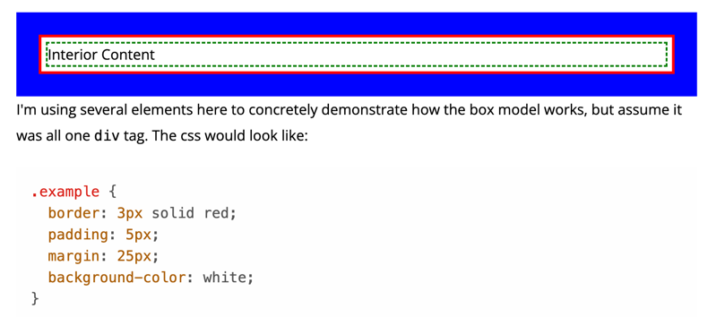

# CSS
## CSS Box Model

How would you put boxes next to one another?
Divs by default take the entire line to themselves. You will need to use
float left or something similar to change that behavior.

What is the box model of CSS?
Every tag in CSS has a display property which is by default 'block'.

What are some other display values?
inline - makes whatever the tag is behave like text. The browser will determine
the height width padding margin and you cannot override them. If you are trying
to set a width or height and the browser is not respecting it you probably have the
wrong display type.



Explain margin:
The space outside of the element between it and the other elements.
The margin is outside of the border.
Explain border:
Inner to the margin. Not every element needs a border easy to color to see.
Explain padding:
Inside the border this is the space inside the element if you give something
a background-color you will color the padding space.

How can you select literally everything to apply cs to?
You can use the wildcard and you should probably only ever use it to set the below
property
```css
*{
    box-sizing: border-box;
}
```

What does border box do? Explain it with a border with a width of 3 pixels and 
a width of 100. If you didn't use border box then the border would be 106 pixels 
= 100width + 2* border width. Border-box helps prevent you from needing to do that
math. It makes the width 100 and includes the border width in that width.


