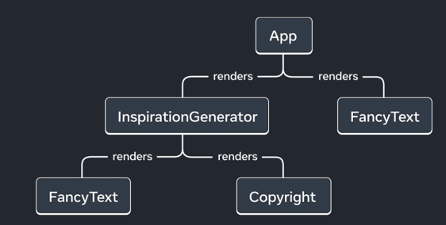

# UI as tree

Render Tree:

Render Trees refer just to react components not html.
Render tree are platform agnostic and could be used for desktop or mobile.

Dependency trees can also be useful and include non component files that must
be imported. For example sample data files. This can help debug large bundle sizes.
You could notice slow time to paint and optimize the code potentially.

