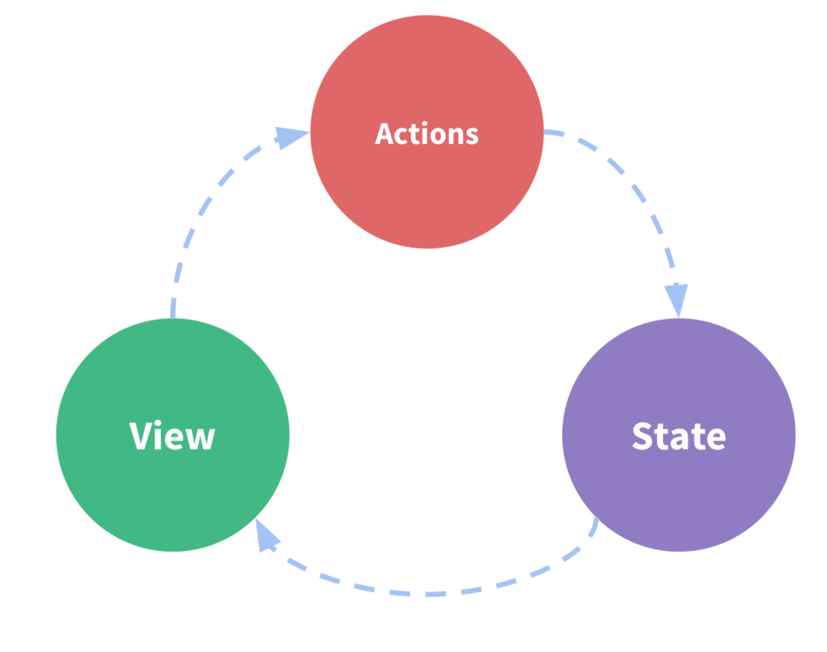

# Overview
What is redux?
A pattern and library for managing and updating application state using events called actions.
There is a central store for state that has rules ensuring it can only be updated in predictable ways.

Why is redux needed?
Some components need access to global state to react to things changing.

What are the associated libraries to make it work with react?
React-Redux: A package that lets your components read state from the store and dispatch actions
to change the store.

Redux Toolkit: A recommended approach to writing logic simplifies most redux tasks and
prevents common errors.

Redux DevTools Extension: Show history of changes in your redux store over time.
Allows you to debug apps with "time-travel debugging". Similar to watches.

## Concepts
### One Way Data Flow
**State** describes the condition of the app at a point in time. (**Store**)
The UI is rendered based on the state.
When something happens the state is update (**action** is **dispatched** and received by **reducer**)
The UI **subscribes** to that change and re-renders



### Immutable
JS objects and arrays are **mutable** by default. Change them however you like.

How can you change an immutable data structure or type?
Create a copy of the original data structure with updated values.
**Redux store is immutable. All state update must be done via copies**


Which javascript operator makes it easy to make copies and overwrite certain values?
The spread operator. Note how easy it is to overwrite a portion of the spread.
```js
const obj = {
  a: {
    // To safely update obj.a.c, we have to copy each piece
    c: 3
  },
  b: 2
}

const obj2 = {
  // copy obj
  ...obj,
  // overwrite a
  a: {
    // copy obj.a
    ...obj.a,
    // overwrite c
    c: 42
  }
}
```

What is an **Action** in Redux?
An object that has a type field that is a string. 
It represents an event that describes something that happened in the app
By convention actions also usually have a payload field with information about what
happened.

What is an **Action Creator** in Redux?
A function that creates and returns an action object. Avoids writing actions by hand
and allows actions to be dynamic in their creation.
```js
const addTodoAction = text => {
    return {
    type: 'todos/todoAdded',
    payload: text
    }
}
```

What is a **Reducer** in Redux?
A function that receives state and an action object. It contains the logic for how
to update and return the new state. It listens for actions like an event listener.
```js
(state,action) => newState
```

Where do **reducers** get their name?
They are similar to the callback function you pass to Array.reduce(). Array.reduce()
allows you to produce a single final result taking into account all the values in an
array. It takes a callback function with two args: 
previousResult: The value your callback returned last time.
currentItem: The current item in your array.
A reducer takes a previousResult state and the currentItem action and decides a new state
value based on those arguments and returns the new state.
```js
const numbers = [2, 5, 8]

const addNumbers = (previousResult, currentItem) => {
  console.log({ previousResult, currentItem })
  return previousResult + currentItem
}

const initialValue = 0

const total = numbers.reduce(addNumbers, initialValue)
// {previousResult: 0, currentItem: 2}
// {previousResult: 2, currentItem: 5}
// {previousResult: 7, currentItem: 8}

console.log(total)
```
What are the rules reducers must **always** follow?
- only calculate new state based on state and action params.
- can't modify existing state must make immutable updates by copying.
- must not do asynchronous logic, calculate random values or cause side effects.

What are the steps of logic within a **reducer** function?
- Check to see if reducer cares about the action (usually an if action.type == reducer)
  - update state via copy if so.
- otherwise return existing state unchanged
```js
const initialState = { value: 0 }

function counterReducer(state = initialState, action) {
  // Check to see if the reducer cares about this action
  if (action.type === 'counter/increment') {
    // If so, make a copy of `state`
    return {
      ...state,
      // and update the copy with the new value
      value: state.value + 1
    }
  }
  // otherwise return the existing state unchanged
  return state
}
```

What is the Redux **store**?
The current application state object.

How is the store created?
By passing in a reducer to configure store.

How can you get the current state of the application?
the store.getState method.

What is **dispatch**?
a Method on the store. store.dispatch(action object).
The only way to update the state is to call store.dispatch().

What listens for the actions?
A reducer listens for the action they are interested in and update the state in response.
Dispatching action is like triggering and event. Reducers are like event listener and update
the state when the action is triggered.

What are **Selectors**?
functions that know how to extract specific pieces of information from a store state.
```js
const selectCounterValue = state => state.value

const currentValue = selectCounterValue(store.getState())
console.log(currentValue)
// 2
```

Give the breakdown of Redux including initial setup of store and first render of ui.
Followed by Updating something based on a button click.
Setup
1. Redux store created using root reducer function.
2. Root reducer is called once and saves the return value as initial state.
3. UI looks at the current state of the store before it is rendered. It renders the 
first time and subscribes to subsequent changes in the store.

Update
1. A user clicks a button
2. The app code dispatches an action to the redux store `dispatch({type: 'counter/increment'})`
3. Store runs the reducer function again with previous state and received action. Produces new state.
4. Store notifies UI elements that are subscribed.
5. UI components the have changed data force a re-render to show updated data on screen.


