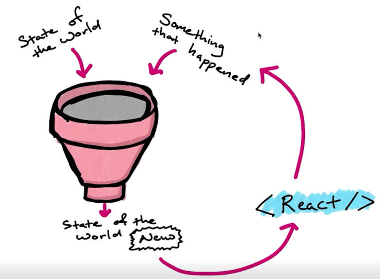

How many methods or functions does the Redux API really have? How many does the store have?
Redux has about 5
Store has about 4 more.


How can we take the below 3 functions and apply all of them to a string?
```js
const makeLouder = string => string.toUpperCase()
const repeatThreeTimes = string => string.repeat(3)
const embolden = string => string.bold()
```
Compose a function
```js
threeTimesAndEmboldenLoud = string => embolden(repeatThreeTimes(makeLouder(string)))
```

A helper method that comes with redux is called `compose()` it takes these
arguments and does the composition for you.
Ex:
```js
threeTimesAndEmboldenLoud = compose(embolden,repeatThreeTimes,makeLouder)
```

## MAKING A STORE
What is a reducer?
2 things go in:
- State of the World (a js object)
- Something that happened (a js object)

They are **reduced** to one thing that comes out 
- New State of the world (a js object)


```js
const initialState =  {value: 0}
const reducer = (state, action) => {
    return state //no change here because we didnt use the action
}
const store = createStore(reducer)
```

### Creating an Action
What is an action? 
A Js object that describes a change that should happen in the store. (the applications state)

There is only **one** requirement for creating an action
```js
const incrementAction = {type: 'INCREMENT'}
```
that it has a type.

What else might you see in the action objects properties?

**payload**: (most common) - contains information or data that is necessary to perform the state update
Example (payload is often an object):
```js
const addBookAction = {
    type: 'ADD_BOOK',
    payload: {
    id:1,
    name: 'Redux Handbook',
    quantity:2
    }
}
```

**meta**: can contain meta data about the action

**error**: can communicate info about error that might have happened.

Why are action types screamed (all_caps) as convention? (convention changes in react redux)
Seems like sometimes variables are preferred to strings to prevent mispelling errors. 

Ex:
```js
const INCREMENT = 'INCREMENT'
const incrementAction = {type:INCREMENT}
```

What is an actionCreator?
A function that creates your action object.
```js
const increment = () => ({type:INCREMENT, payload:1})
const add= (amount) => ({type:ADD, payload:amount})

const reducer = (state,action) => {
    if (action.type === ADD){
        return {value:state.value + action.payload}
    }
    return state
}

```
Action creators are totally optional but can make your code a bit easier to update. 
Just update the function instead of tracking down all the objects.


### Setting initial state of the store 2 options
```js
const initialState =  {value: 0}
const reducer = (state, action) => {
    return state //no change here because we didnt use the action
}
const store = createStore(reducer, initialState) //Prevents errors if your didn't provide an initial state you would be
//attempting to get value on an undefined object in order to add one. Undefined doesn't have a value property
```
**OR** Provide it as a default param to the reducer
```js
const reducer = (state=initialState, action) => {
    if(action.type === INCREMENT) {
        return {value: state.value + 1}
    }
    if(action.type === ADD) {
        return {value:state.value+action.payloadType}
    }
    return state
}
//NOW create store DOES NOT NEED initialState // because the reducer default arg has it
const store = createStore(reducer)
```

Should a reducer have this type of if switch statement or should you write multiple reducers?

Depends on the size of your application. If large then write individual reducers.

### Dispatch
A function that sends or **dispatches** an action to the store. 
```js
const store = createStore(reducer, initialState) 
store.dispatch(increment()) //takes your action creator which will produce an action object
//Passes the action to the store wheere it will be received by the reducer alongside the current state.
console.log(store.getState()) //Will show your changes.
```

### Rules for Reducers
- No mutating objects. If you touch it you replace it. With a new object
- You have to return something and ideally, it should be the unchanged state if you missed all the if switches shown above.
- Prefer Flat Objects sometimes even if you need a translation layer from the bend.

### Subscribers
What does a store.subscribe() do?
Subscribe listens for changes in the redux store and calls the function (sometimes call a listener) you pass it.
For example below each time you dispatch an action to the store the listener is called and logs the store.
```js
const listener = () => console.log('SUBSCRIBER', store.getState())
store.subscribe(subscriber) //Now every time the store changes we call the subscriber
store.dispatch(increment()) //subscriber calls and shows new state
store.dispatch(add(1000)) //subscriber calls and shows new state
```

### bindActionCreators
This is a nice helper method but totally optional
actionCreators are functions that create action objects.
bindActionCreators takes an object full of action creators and whatever you want to bind them to.
Usually you need to call dispatch and pass it the function with this pattern. You can simply call the
bound action creator.
```js
const actions = bindActionCreators({increment,add},store.dispatch)
actions.add(1000) //Allows you to dispatch actions without needing to call store.dispatch
```

Under the hood you can imagine this code is probably something like:
```js
[dispatchIncrement, dispatchAdd] = [increment,add].map(fn => compose(store.dispatch,fn))
```

### Combine Reducers
```js
const initialState = {
    users: [
        {id:1,name:"Steve"},
        {id:2,name:"Eric"}
    ],
    tasks: [
        {title:"File the TPS reports"},
        {title:"Order more energy drinks"
        }
    ]
}
const ADD_USER = "ADD_USER"
const ADD_TASK = "ADD_TASK"
const add_task = (title) => {type:ADD_TASK, payload: {title}}
const add_user = (name) => {type:ADD_USER, payload: {name}}

const reducer = (state = initialState, action){
    ///MUTATE DO NOT! Must return new STATE the FULL state
    if(action.type===ADD_USER){
        return state.users.push({id:state.users.length+1,action.name}) 
    }
    //BETTER
    if(action.type===ADD_USER){
        return {
            ...state.tasks, 
            users: [...state.users,{id:state.user. action.payload}]}
    } 
    
    if(action.type===ADD_TASK){
        return state.tasks.push({title:action.title})
    }
    return state
}
```


